### AIoT • Sistemas Embarcados • Automação • Energia Off-Grid

<!-- HEADER PREMIUM -->
  

  <h2>Building Intelligent Systems & Elegant Digital Experiences</h2>

  

    AI • Data Science • Embedded Systems • Human-Centered Design  
    Transformando complexidade em soluções inteligentes, visuais e eficientes.
  

   

---

## 👨‍💻 Sobre

Engenheiro de soluções com **12+ anos de experiência prática** no desenvolvimento de sistemas eletrônicos e embarcados baseados em **Arduino, ESP32 e microcontroladores de alta performance**.

Atuo na interseção entre:

* 🔋 Energia renovável & sistemas off-grid
* 🌐 IoT & Telemetria em tempo real
* 🏠 Smart Home orientada a dados
* ⚙️ Integração eletromecânica & CNC
* 🤖 Automação com inteligência aplicada

---

# 🌱 Energia & Sustentabilidade

## ☀️ Infraestrutura Solar

  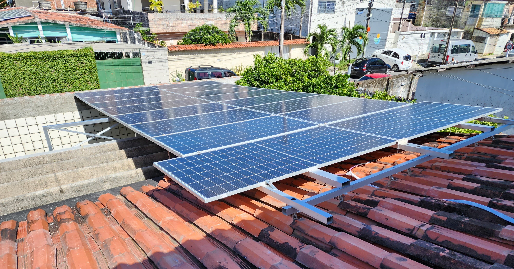

---

## 🔋 Sistemas Off-Grid

  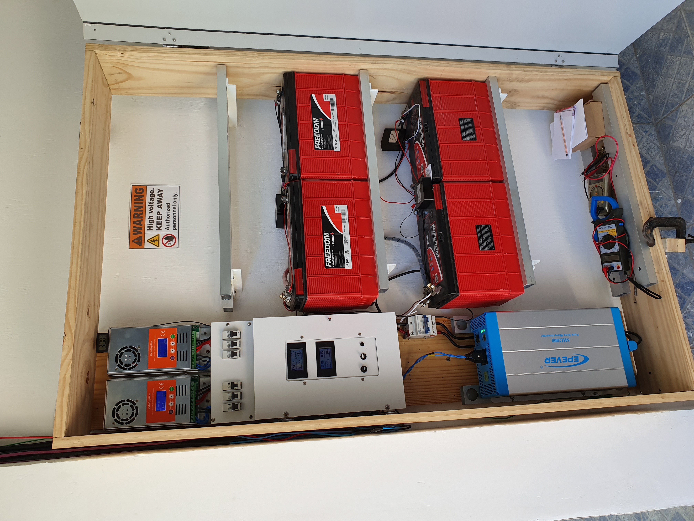

---

## ♻️ Rádio Solar Sustentável

  

---

## 🌳 Tecnologia Verde

  

---

# 🏠 Smart Home & AIoT

  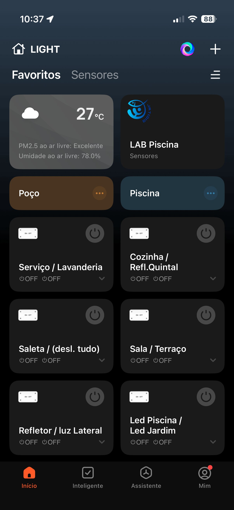

---

## ⚡ Nobreak Inteligente (ESP32-S3)

  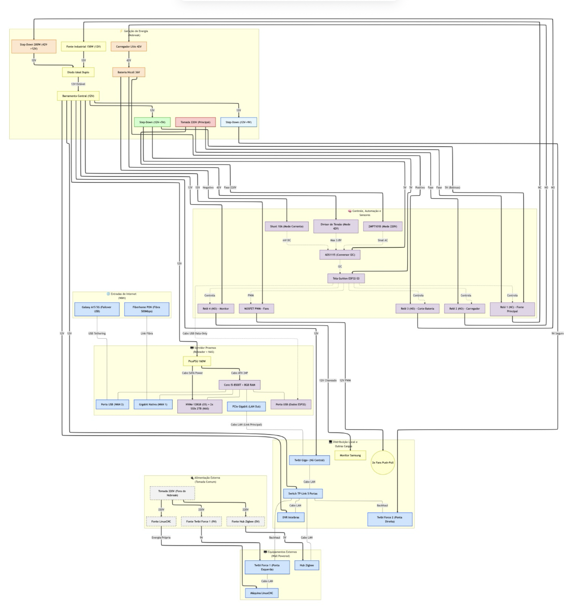

---

# 💧 Monitoramento Ambiental & IoT

## 🚰 Monitoramento de Nível

  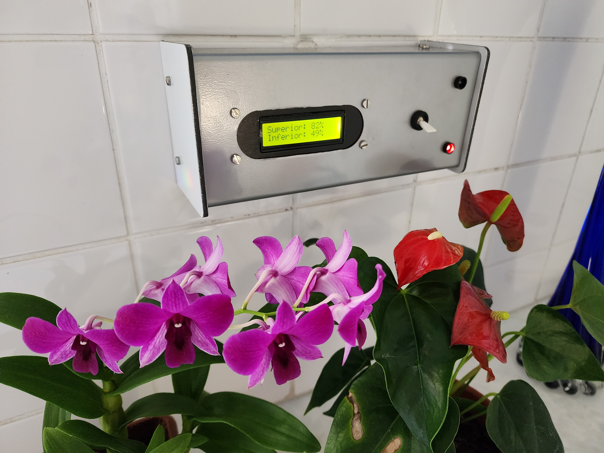
  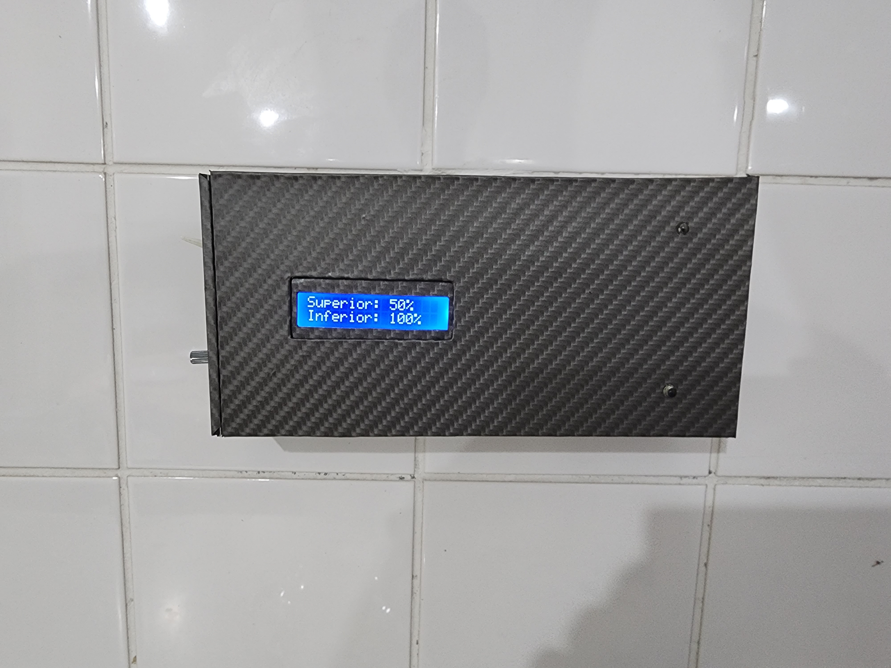

---

## 🧪 Qualidade da Água (pH & ORP)

  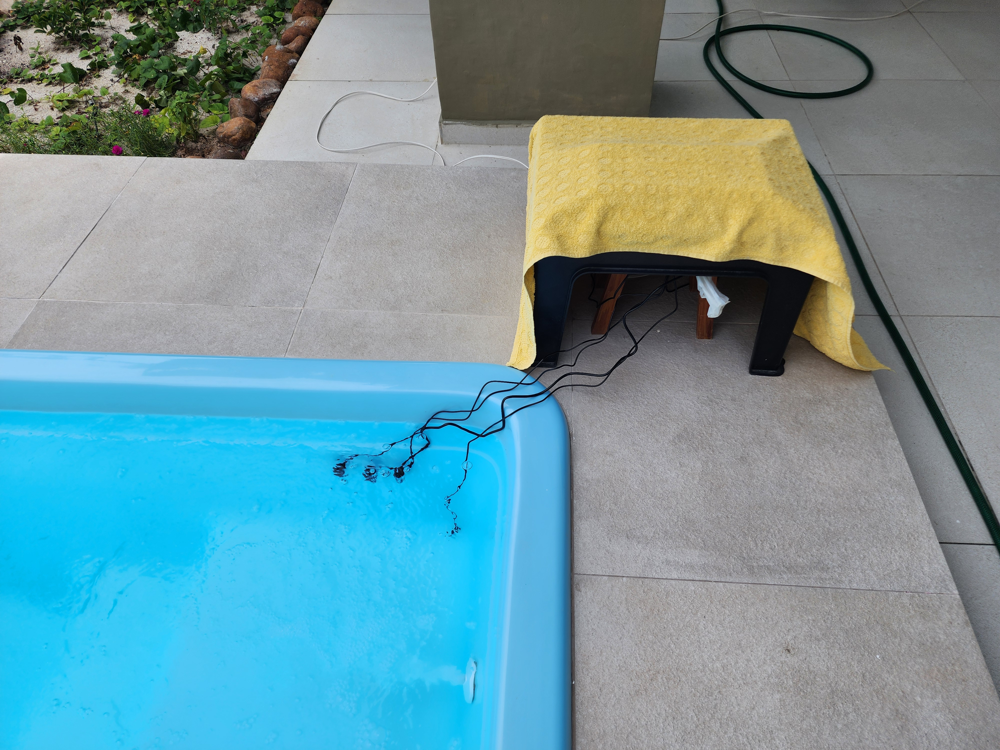

---

## 📊 Dashboard de Sensores

  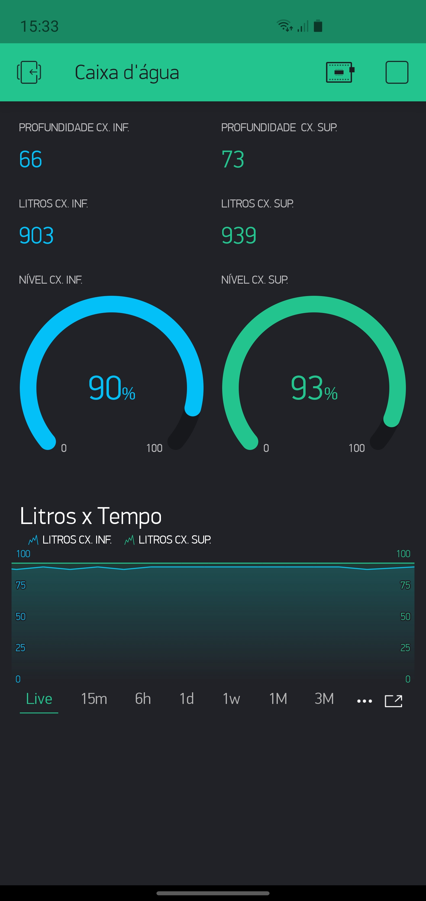

---

# ⚙️ Engenharia & CNC

## 🛠️ Fresadora CNC

  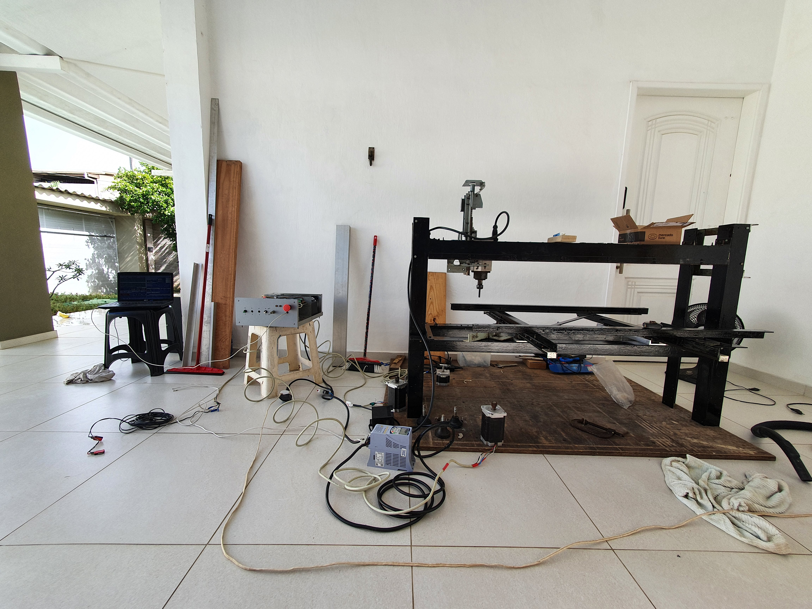

---

## 🔬 Prototipagem

  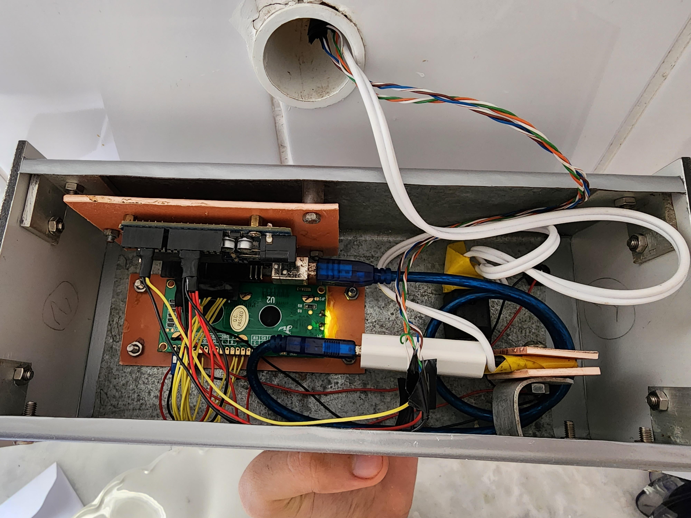
  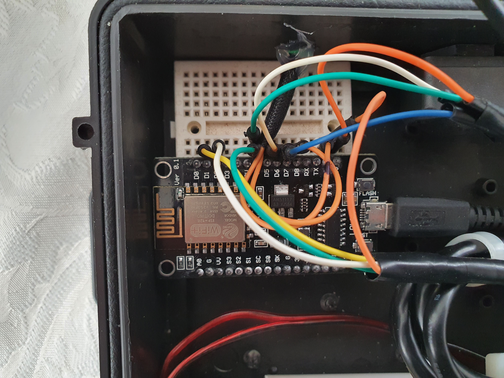

---

## 🔦 Lanterna Inteligente

  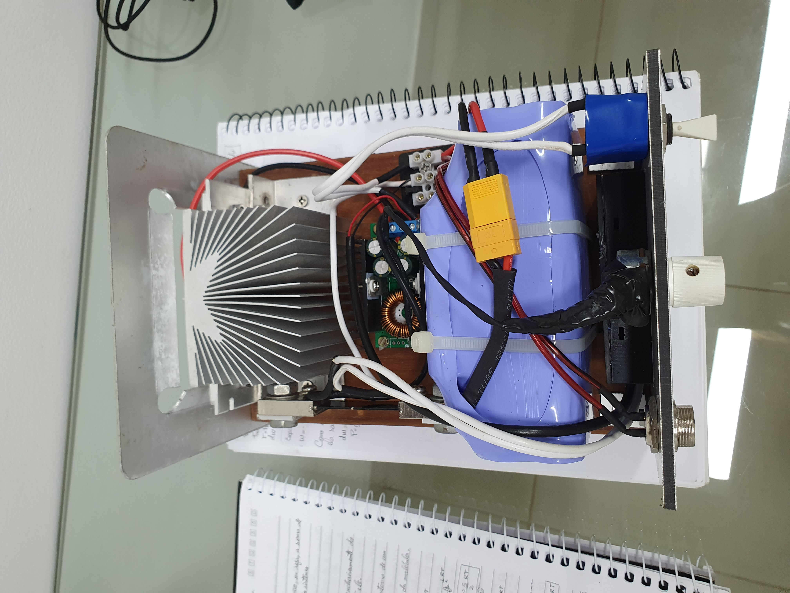

---

# 🤝 Contato

📎 **LinkedIn:** [willianrupert](https://www.linkedin.com/in/willianrupert)  
📩 **E-mail:** [wnrj@cin.ufpe.br](mailto:wnrj@cin.ufpe.br)

---

  <h3 style="color:#4364F7;">Engineering intelligence into reality.</h3>

  <!-- FOOTER PREMIUM -->
  

